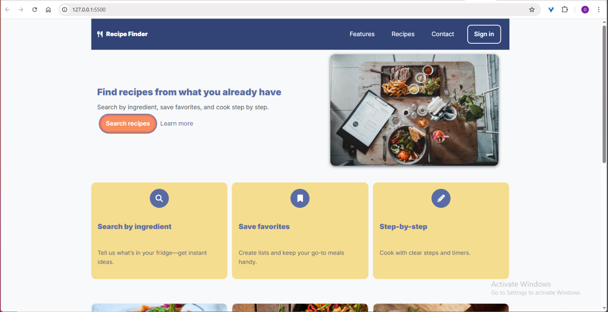

# Recipe Finder (Landing Page)

A responsive landing page for a fictional recipe-search app. Built mobile-first with semantic HTML and modern CSS.

## Live Demo
<!-- Replace this after publishing -->
https://ovigota.github.io/RecipeFinder

## Features
- Clean, responsive layout (grid + flex)
- Mobile dropdown navigation
- Reusable cards (features & recipes)
- Accessible landmarks, focus styles, and lazy-loaded images
- Color palette via CSS variables

## Tech
- HTML5, CSS3
- Google Fonts (Inter)
- Font Awesome (icons)

## Project Structure

recipe-finder/
├─ index.html
├─ styles.css
├─ images/
│ ├─ pexels_front.jpg
│ ├─ recipe-1.jpg
│ ├─ recipe-2.jpg
│ ├─ recipe-3.jpg
│ └─ logoSarthius.png
└─ README.md

##  Getting Started (local)
Open `index.html` in your browser.  
For live reload, use any static server (e.g., VS Code “Live Server” extension).

##  Color Palette
- Primary: `#586BA4`
- Primary Dark: `#324376`
- Accent 1: `#F5DD90`
- Accent 2: `#F68E5F`
- Accent 3: `#F76C5E`
- Text: `#495057`
- Border: `#DEE2E6`

##  Accessibility
- `<main>`, section headings
- `:focus-visible` styles
- Descriptive `alt` on images
- `loading="lazy"` on recipe thumbs

##  Future Improvements
- Real search (JS/API)
- Dark mode (CSS variables)
- Animate-on-scroll (reduced-motion friendly)
- More recipe cards + pagination

##  License
MIT © OviGota

